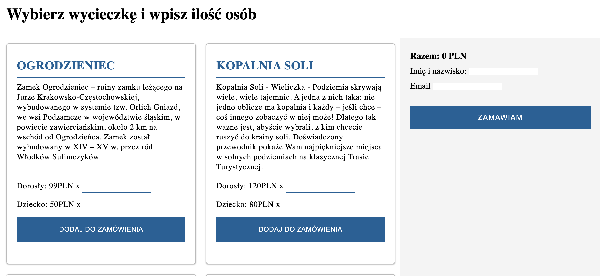
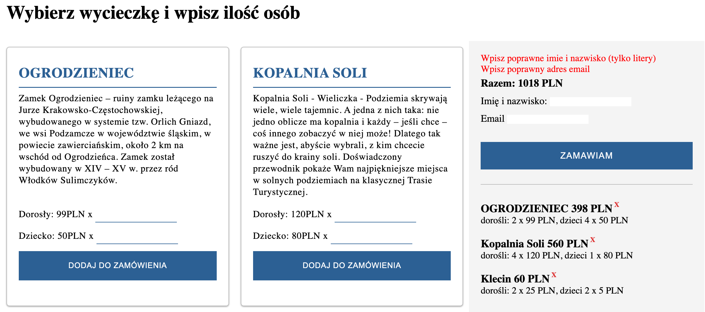
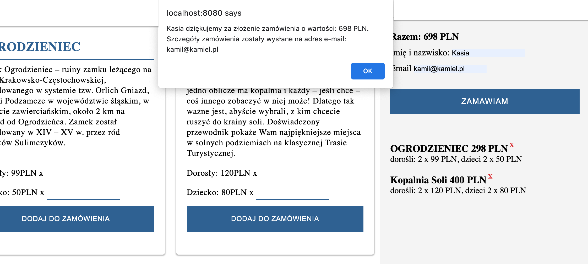
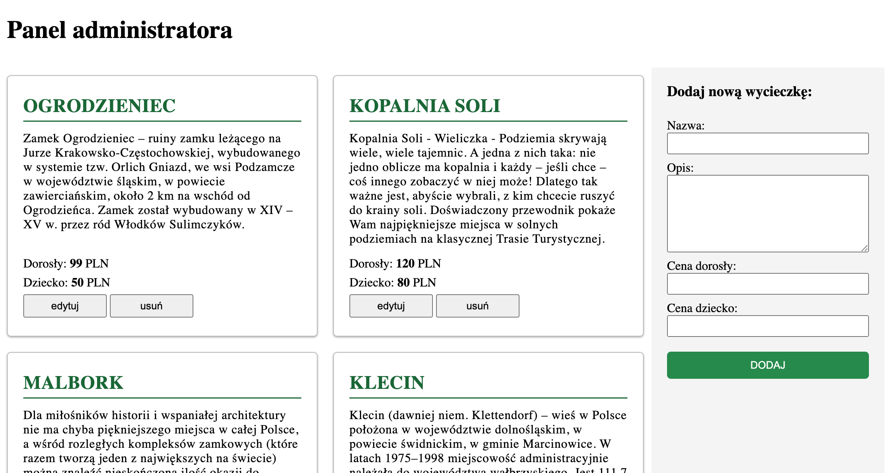
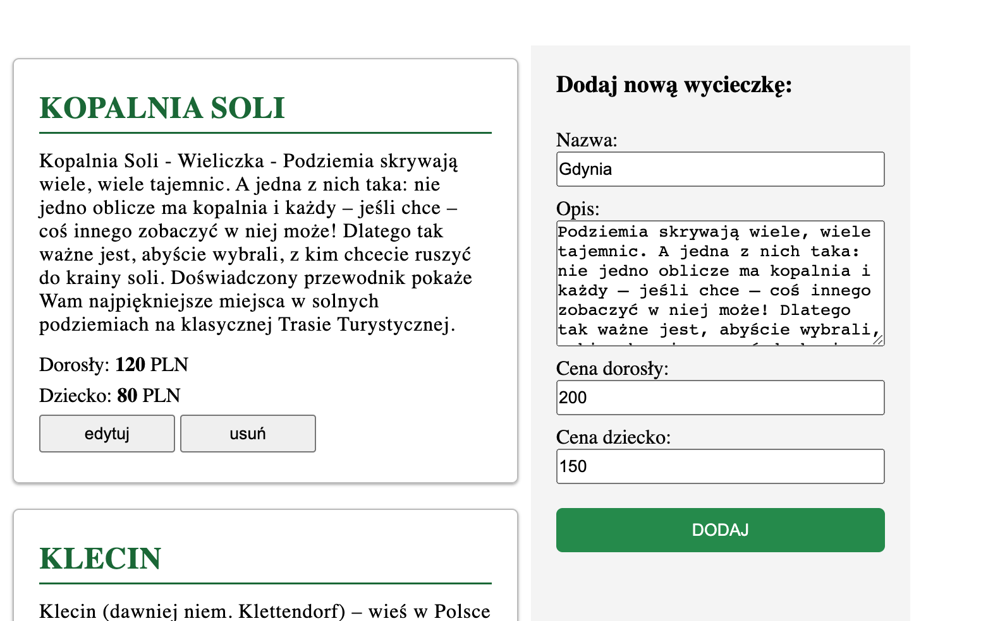
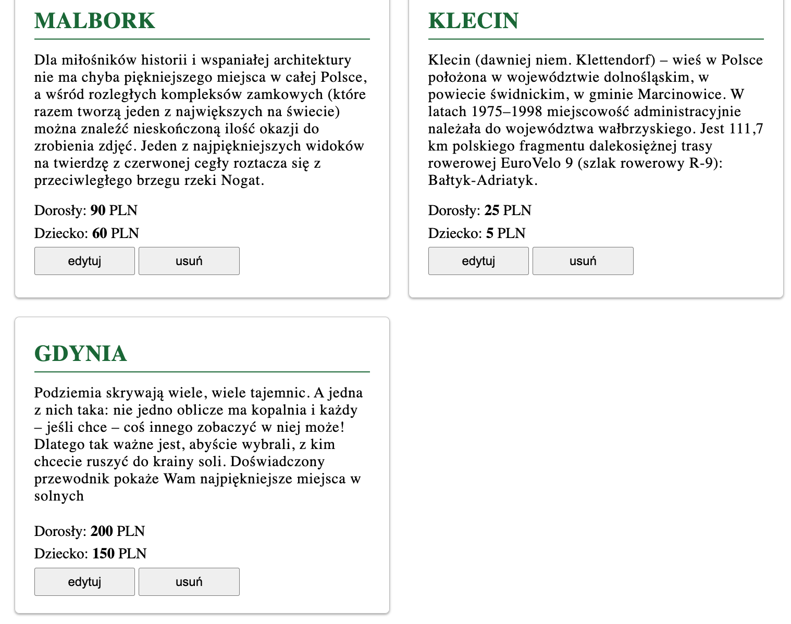

# Excursion Project - Admin & Client Panel

## Table of Contents
1. [About the project](#about-the-project)
2. [How to see it](#how-to-see-it)
3. [Technologies](#technologies)
4. [Solutions](#solutions)
5. [Project preview](#project-preview)
6. [Contact](#feel-free-to-contact-me)
7. [Thanks](#thanks-for-project-and-support-to-Mateusz-Bogolubow)

## About the project
The aim of the project was to rebuild the previous one: “The Excursion Project” as well as to update the extension functionality by adding the Admin panel. When working on it I used JSON server as my local API.


#### CLIENT PANEL
The Client can:
* choose a trip and after typing the number of adults and children they can add the trip to the basket
* remove the previously chosen trip from the basket
* finalizing the order and view the summary of it including the price

Features:
* in the basket a client always sees the actual value of the total order and the price will get updated after removing items from the basket
* form validation check if data is correct and showing errors when data is wrong
* correct data is sent to the API by using JSON Server and after that the inputs fields are cleared


#### ADMIN PANEL
The Admin can:
* add a new excursion
* remove an excursion
* update an excursion: title, description, prices

Features:
* client can see changes after reload page
* data is sending to the API using JSON Server and inputs fields are cleared.

Data of the form of the admin panel is not validated (I know that is a necessary functionality but a lack of time didn’t allow me to finish that functionality).

## How to see it
Please, refer to the screenshots, which are attached below. Moreover, I am working on a form of a video preview as an additional reference guide.

## Technologies
* JavaScript
* HTML
* CSS
* JSON Server
* Desktop only version

## Solutions
By creating this project I had an opportunity to practice/learn:
* CRUD operation in JavaScript
* working with API and practice fetch()
* working with class - "ExcursionAPI" -  build resuable code
* a new funcionality like "remove item from basket"
* ways to check if data in inputs is correct before sending a form
* working with existing HTML structure using prototypes (.*--prototype)

The most interesting part was CRUD operation in JavaScript. In the ExcursionAPI.js I have created class with functions like:

```
loadData(){
        return this._fetch();
    }
```

```
removeData(id){
        const options = {method:'DELETE'};
        return this._fetch(options,`/${id}`);
    }
```

```
updateData(id,data){
        const options = {
            method:'PUT',
            body: JSON.stringify(data),
            headers: {'Content-Type': 'application/json'}
        };
        return this._fetch(options,`/${id}`);
    }
```

```
addData(data){
        const options = {
            method: 'POST',
            body: JSON.stringify(data),
            headers: {'Content-Type': 'application/json'}
        };
        return this._fetch(options);
    }

```

Additionally I used same functions “loadData()” in two files: admin.js and client.js.

The project was challenging as I had to use a variety of functions and connect them together. I had opportunity to practice anew functionalities I have learned with ECMAScript 2015. That is a summary of my learning outcomes of JavaScript.

### Project preview
Client panel


Order form validation


Information after making an order


Admin panel


Form to add a new excursion


Added excursion on the list 


### Feel free to contact me:
* [Linkedin](https://www.linkedin.com/in/ewelina-kopacz-929559100/) - Ewelina Kopacz

### Thanks for project and support to Mateusz Bogolubow:
* Mentor i Trener Programowania JavaScript - [DevMentor](https://devmentor.pl/) - Mateusz Bogolubow